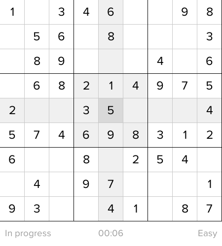
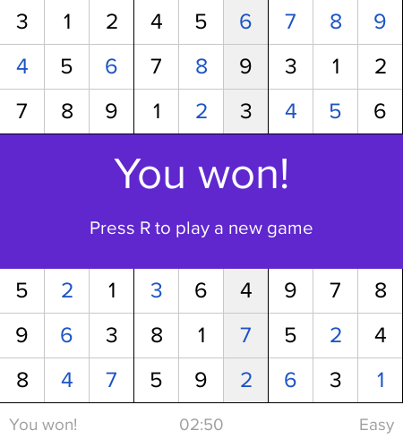
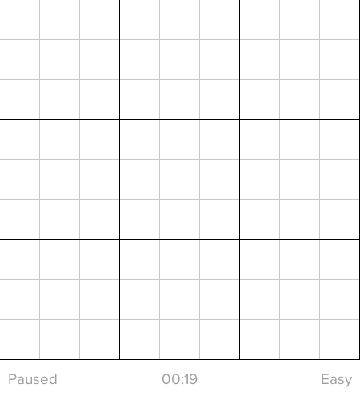

<p align="center">
  
</p>

<h1 align="center" style="text-align: center; padding-bottom: 15px;">Vudoku</h1>
<p align="center" style="text-align: center; padding-bottom: 15px;">A simple sudoku game written in <a href="https://vlang.io/">V lang</a></h1>
<p align="center">
  
  <a href="https://webuild.community"></a>
</p>

## Introduction

The origin of the name is quite obvious "v" + "sudoku" = "vudoku". This is the project I created to try out v lang again after several months so if you have a thing for spaghetti, feel free to dig into my code :smile:.

## How to build

This is a standard v lang project so building should be quite straightforward.

1. Install [vlang](vlang.io/)
2. Clone this repo
3. Run `v build .`

## How to play

If you don't know sudoku, please read about it [here](https://en.wikipedia.org/wiki/Sudoku).

### Start the game

When starting the game, you can specify the difficulty by passing an argument to the game. There are 4 levels of difficulty:

1. Easy
2. Medium
3. Hard
4. Expert

So let's say you just started out and want to try the `expert` level. You would start the game with this command:

```
./vudoku expert
```

> **Note:** By default, if you don't specify anything, the game will use easy level

### Restart / New game

If you wins the game or you just want to restart to a new game, press `r`.

### Navigation

You can use the arrow keys to navigate in the game or if you are a vim user `hjkl` ftw!

Otherwise, you can also use mouse to click on the cell you want to edit.

### Clear the cell

Oh no, you somehow messed up and want to clear the value of a cell that you have filled. No worries, just press `c` to clear the current cell that you are on.

### Pause / Resume the game

If you wife come at you and say "we need to talk" or there's an earthquake at your place and you want to pause the game, just hit `p` to pause or resume the game and I hope that you survive the situation.

### TLDR

| Key                                     | Function               |
| --------------------------------------- | ---------------------- |
| Arrow keys / h j k l / Mouse left click | Navigate between cells |
| p                                       | Pause / Resume game    |
| r                                       | Restart / New game     |
| c                                       | Clear the current cell |

## Screenshots

<p align="center">
  
</p>

<p align="center">
  
</p>
<p align="center">
  
</p>

## Author

Vudoku is a project by:

- Viet-Hung Nguyen ([@ZeroX-DG](https://github.com/ZeroX-DG/))

### License

- [MIT](LICENSE)

## Contribute & Support

All pull requests are welcome!

If you wish to support the author, you can buy him a coffee...though he would prefer tea instead, but coffee is fine.

[](https://ko-fi.com/Z8Z81ODLC)